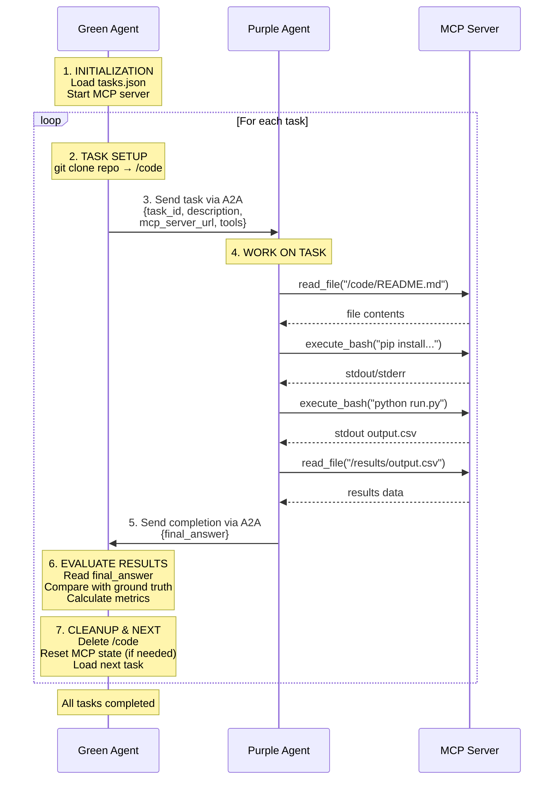

# AgentBeats x CORE-Bench

**Testing AI Agents' Ability to Reproduce Published Scientific Research**

🔬 **[CORE-Bench](https://github.com/siegelz/core-bench)** ("Computational Reproducibility Agent Benchmark") by [Siegel et al.](https://openreview.net/forum?id=BsMMc4MEGS) tests the ability of AI agents to reproduce the results of scientific publications based on code and data provided by their authors. 

We *agentified* CORE-Bench (as implemented in [HAL](https://github.com/princeton-pli/hal-harness)) for the [AgentBeats](https://agentbeats.ai) platform by:
- Adding a "green agent" orchestrator
- Expanding with 27 newer research papers
- Introducing alternative success metric that rewards partial progress toward the goal in lieu of binary pass/fail


## How it works

72 tasks across computer science, social science, and medicine—each testable at three difficulty levels.

| Component           | Role                                                                                          |
| ------------------- | --------------------------------------------------------------------------------------------- |
| 📦 **Code Capsules** | Pre-packaged research tasks containing code and data from published papers.                   |
| 🟣 **Purple Agent**  | The agent under test. Reasons about tasks and requests actions to reproduce research results. |
| 🟢 **Green Agent**   | Orchestrates the test. Executes Purple's requests and measures reproduction success.          |
| 🔧 **MCP Server**    | Provides the tools Purple uses: file operations, code execution, and more.                    |

### Difficulty Levels
| Difficulty | Agent Has Access To                                               | Agent Must...                             |
| ---------- | ----------------------------------------------------------------- | ----------------------------------------- |
| **Easy**   | Codebase with pre-computed results, run instructions, and scripts | Read and extract answers from results     |
| **Medium** | Codebase with run instructions and scripts                        | Follow instructions to regenerate results |
| **Hard**   | Source code only                                                  | Figure out how to run from scratch        |

---

## Quickstart

1. Clone the repo
```bash
git clone git@github.com:ab-shetty/agentbeats-corebench.git
cd agentbeats-corebench
```
2. Install all dependencies
```bash
uv sync
```
3. Set environment variables: `NEBIUS_API_KEY` & `OPENAI_API_KEY`
```bash
cp sample.env .env
```
4. Run the Benchmark:
```bash
uv run agentbeats-run scenarios/corebench/scenario.toml --show-logs
```

## Custom Configuration

**LLM Models:**
- **Purple & Green Agents**: uses `nebius/openai/gpt-oss-120b`
  - Change model by setting `COREBENCH_TEXT_MODEL` in `.env`
- **LLM-as-a-Judge**: uses `gpt-5-mini`
  - Change model by setting `judge_llm` in `scenario.toml`
  - *Why gpt-5-mini?* achieved 56% lower variance than alternatives, σ < 0.05 [read about our tests here](scenarios/corebench/metrics/internal/LLM_JUDGE_CONSISTENCY.md)

**Benchmark Settings** (`scenario.toml`):
```toml
[config]
domain = "corebench_hard"           # difficulty: _easy, _medium, or _hard
num_tasks = 10                      # tasks to run (max 72)
# task_ids = ["capsule-9670283"]    # run specific tasks
keep_traces = true                  # save execution traces
use_cache = true                    # cache capsules locally
# judge_llm = "gpt-5-mini"          # customize judge model
```

---

## Evaluation Metrics

The original CORE-Bench only measured binary pass/fail based on answer accuracy. We add **methodology** and **task adherence** metrics that provide insight into actual progress—how far did the agent get?—and guidance on where it can improve. These metrics have also exposed shortcuts: we found cases where agents retrieved the right answer without genuine reproduction, such as extracting figure labels directly from code.

The evaluator computes three complementary metrics:

**Accuracy** (Deterministic)
- Percentage of correct answers, as in the original CORE-Bench
- Numeric answers use 95% prediction intervals to handle ML stochasticity

**Methodology** (Deterministic, 0-1)
- Evaluates good-practice reproduction methods: Did the agent read the README and script files? Did it execute the expected scripts?
- Points awarded based on how many of these "steps" the agent took

**Task Adherence** (LLM-as-Judge, 0-1)
- Passes tool calls, results, task README, and questions to an LLM judge
- Scores the agent on:
  - *Process quality*: Did it execute the correct scripts and extract results?
  - *Problem solving*: How well did it handle errors?
  - *Discovery*: How efficiently did it find information?
  - *Technical ability*: Command correctness, avoiding redundant operations

Gold Standard for hard mode: *Understand the codebase → Execute the code → Debug errors if needed → Extract results*

### Leaderboard Metrics: Tasks Passed & Process Score

For the leaderboard, we report the original pass/fail accuracy alongside a new **process score**—an aggregate of accuracy, methodology, and task adherence. This metric better captures agent capabilities than pass/fail alone, rewarding partial progress and good process even when final answers are incorrect.

**Tasks Passed** = number of tasks where the agent got all answers correct (original CORE-Bench metric)

$$
\text{process\_score}
  = \frac{0.7\,(\text{methodology\_score} + \text{adherence\_score})/2 + \text{tasks\_passed}}
         {\text{total\_tasks}}
$$


**Interpreting results:**
- High accuracy + low methodology → agent likely took shortcuts
- Low accuracy + high methodology → correct process but environment/dependency issues
- All metrics aligned → agent succeeded or failed consistently

See our [detailed metrics documentation](scenarios/corebench/metrics/README.md) for scoring weights and [LLM judge consistency tests](scenarios/corebench/metrics/internal/LLM_JUDGE_CONSISTENCY.md).

---

## Results & Logs

After the benchmark completes, you'll see a summary:

```text
================================================================================
🏆 EVALUATION COMPLETE
================================================================================
✅ Success Rate: 7/25 (28.0%)
📊 Mean Accuracy: 32.0%
📋 Mean Task Adherence: 0.53/1.0
🔧 Mean Methodology Score: 0.49/1.0
   - Doc Read Rate: 76.0%
   - Execution Attempt Rate: 56.0%
   - Successful Execution Rate: 12.0%
```

Per-task output shows detailed scoring breakdown:

```text
1️⃣  Computing accuracy...
   ✓ Accuracy: 1/1 (100.0%)

2️⃣  Extracting methodology metrics...
   ✓ Methodology Score: 0.35/1.0
   Score Breakdown:
     Doc Read:        0.15/0.15  (README.md)
     Script Read:     0.20/0.20  (code/step_2_plot_top1_top2.py)
     Script Attempt:  0.00/0.45  (not attempted)
     Run Success:     0.00/0.20  (✗ no successful run)

3️⃣  Computing task adherence (LLM judge)...
   ✓ Adherence Score: 0.67/1.0

💭 Judge Reasoning:
   Core Process (28/50) – Understood the code but did not finish the required script.
   Problem Solving (19/25) – Strong debugging: identified and fixed multiple issues.
   Discovery (12/15) – Quickly located README and relevant files.
   Technical (8/10) – Correct commands, minimal redundancy.
```

Full execution traces are saved to: `logs/traces/corebench_trace_<date>_<run_id>.jsonl`

---


## Repository Overview

```
agentbeats-corebench/
├── scenarios/
│   └── corebench/
│       ├── scenario.toml
│       ├── corebench_agent.py      # Purple agent
│       ├── corebench_evaluator.py  # Green agent
│       ├── mcp_server.py           # MCP tools
│       ├── mdconvert.py            # Markdown conversion utilities
│       ├── planning_prompts.yaml   # ReAct planning prompts (from smolagents MultiStepAgent)
│       ├── core_test.json          # Task definitions
│       ├── metrics/                # Evaluation metrics
│       ├── capsules/               # Cached research capsules
│       ├── workspace/              # Purple agent execution sandbox
│       │   ├── code/
│       │   ├── data/
│       │   └── environment/
│       └── shared_logging.py
├── src/agentbeats/
│   ├── run_scenario.py             # Main CLI entrypoint (agentbeats-run)
│   ├── client.py                   # A2A client implementation
│   ├── green_executor.py           # Green agent execution logic
│   ├── tool_provider.py            # MCP tool integration
│   └── models.py                   # Shared data models
├── logs/
│   └── traces/
├── sample.env
└── pyproject.toml                  # Python dependencies
```

---

## Architecture Diagram



---

## Troubleshooting

| Issue                 | Solution                                                                                       |
| --------------------- | ---------------------------------------------------------------------------------------------- |
| **Command timed out** | Increase `timeout` in `mcp_server.py` and `corebench_agent.py`.                                |
| **Empty answers**     | Check MCP client timeout (600s in `corebench_evaluator.py`). Increase if Docker runs are slow. |
| **0% accuracy**       | Check for scale mismatch (0.96 vs 96.12). Agent may be converting percentages incorrectly.     |

---

## Testing the MCP Server

To test the MCP server functionality using an interactive, web-based MCP inspector:

1. Navigate to `scenarios/corebench` and run:
```bash
uv run mcp dev mcp_server.py
```

2. Click **Connect** > **Tools** > **List Tools** > Select tool to test


3. Alternatively, run the Python test harness (starts MCP server and communicates via JSON-RPC):
```bash
uv run python test_mcp_tools_jsonrpc_full.py
```

---

<details>
<summary><strong>Advanced: Self-Hosted LLM</strong></summary>

For users running their own vLLM/Ollama server locally:

1. Start your server
2. Configure `.env`:
   ```bash
   COREBENCH_TEXT_API_BASE=http://127.0.0.1:8000/v1
   COREBENCH_TEXT_MODEL=ollama/your-model-name
   COREBENCH_TEXT_API_KEY=dummy
   ```
3. Run as usual. 

</details>

(See the [AgentBeats tutorial](https://github.com/RDI-Foundation/agentbeats-tutorial) for an explanation of concepts such as green and purple agents, and technical documentation)
