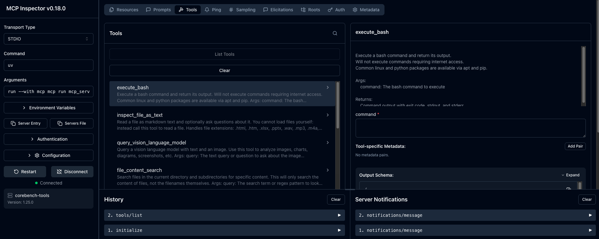
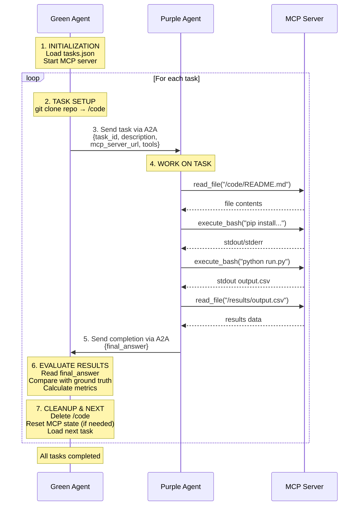

# AgentBeats CoreBench (WIP)

**Testing AI Agents' Ability to Reproduce Published Scientific Research**

🔬 **[CORE-Bench](https://github.com/siegelz/core-bench)** "(Computational Reproducibility Agent Benchmark") by [Siegel et al.](https://openreview.net/forum?id=BsMMc4MEGS) tests the ability of AI agents to reproduce the results of scientific publications based on code and data provided by their authors. We "agentified" the original benchmark (in its current form as part of [HAL](https://github.com/princeton-pli/hal-harness)) for the [AgentBeats](https://agentbeats.ai) platform (adding a green agent orchestrator), expanded the benchmark with newer research papers, and introduced an alternative success metric that rewards partial progress toward the goal in lieu of the original binary pass/fail metric.

## Quickstart
1. Clone the repo
```bash
git clone git@github.com:ab-shetty/agentbeats-corebench.git 
cd agentbeats-corebench
```
2. Install dependencies
```bash
uv sync
```
3. Set environment variables: `NEBIUS_API_KEY` & `OPENAI_API_KEY` in `.env`
```bash
cp sample.env .env
```
4. (Optional) Configure LLM model in `.env` or `scenario.toml` (see LLM Configuration below)
   
5. Run the CoreBench Scenario:
```bash
uv run agentbeats-run scenarios/corebench/scenario.toml --show-logs
```
**Note:** Use `--show-logs` to see agent outputs during the assessment, and `--serve-only` to start agents without running the assessment.

## Custom LLM Configuration

The purple agent uses **Nebius API** `Qwen3-Coder-30B-A3B-Instruct` & **OpenAI API** `gpt5-mini` (for vision only) **by default**. You can customize the LLM model used by the purple agent on the Nebius API in two ways:

   1. Defining an environment variable in `.env`:
   ```bash
   COREBENCH_TEXT_MODEL=meta-llama/Llama-3.3-70B-Instruct
   ```

   2. Adding a model argument in `scenario.toml`:
   ```toml
   [[participants]]
   cmd = "python scenarios/corebench/corebench_agent.py ... --model meta-llama/Llama-3.3-70B-Instruct"
   ```

*(Run as usual)*

**Custom LLM Configuration Priority:**

Model selection follows this priority (highest to lowest):
1. CLI `--model` in `scenario.toml` - best for testing different models quickly
2. `COREBENCH_TEXT_MODEL` env var - good for persistent defaults
3. Default - `Qwen/Qwen3-Coder-30B-A3B-Instruct`

<details>
<summary><strong>Advanced: Self-Hosted vLLM</strong></summary>

For users running their own vLLM server locally:

1. Start your vLLM server
2. Configure `.env`:
   ```bash
   COREBENCH_TEXT_API_BASE=http://127.0.0.1:8000/v1
   COREBENCH_TEXT_MODEL=Qwen/Qwen3-Coder-30B-A3B-Instruct
   COREBENCH_TEXT_API_KEY=dummy
   ```
3. Run as usual:
   ```bash
   uv run agentbeats-run scenarios/corebench/scenario.toml --show-logs
   ```

When `COREBENCH_TEXT_API_BASE` is set, the agent routes requests to your local server instead of Nebius.

</details>

---

## Difficulty Levels

Select the difficulty level by modifying the `domain` field in `scenario.toml`:

```toml
[config]
domain = "corebench_easy"  # Options: "corebench_easy", "corebench_medium", "corebench_hard"
```

| Difficulty | What's Removed                              | Agent Must...                               |
| ---------- | ------------------------------------------- | ------------------------------------------- |
| **Easy**   | Nothing                                     | Execute existing code, extract results      |
| **Medium** | `results/` folder                           | Re-run experiments to regenerate results    |
| **Hard**   | `results/` + `REPRODUCING.md` + run scripts | Figure out how to run the code from scratch |

---

## Evaluation Metrics

CoreBench computes 5 evaluation metrics for each task:

| Metric              | Description                                                                                                       |
| ------------------- | ----------------------------------------------------------------------------------------------------------------- |
| **Accuracy**        | % of questions answered correctly. Uses 95% prediction intervals to handle stochastic variance in ML experiments. |
| **Reproducibility** | % of removed files successfully restored with valid content (medium/hard only). Empty files don't count.          |
| **Faithfulness**    | LLM-as-judge score (0-1): Are answers grounded in actual tool execution evidence?                                 |
| **Task Adherence**  | LLM-as-judge score (0-1): Did the agent properly follow task instructions?                                        |
| **Efficiency**      | Steps used, tool calls made, and execution time.                                                                  |

---

## Results & Logs

You will see real-time evaluation metrics in your terminal: 

```text
⭐ CoreBench Benchmark Results ⭐
Domain: corebench_medium
Tasks: 1/2 passed (50.0%)

📊 Metrics:
  Accuracy: 83.3% (written: 100%, vision: 50.0%)
  Faithfulness: 0.88
  Task Adherence: 0.75
  Reproducibility: 100.0%

📋 Task Results:
  capsule-5507257: ✅ (acc=100%, faith=0.95)
  capsule-3449234: ❌ (acc=66.7%, faith=0.80)
```
Full execution traces are saved to:
```
logs/traces/corebench_trace_*.jsonl
```

---

## Testing the MCP Server

To test the MCP server functionality using an interactive, web-based MCP inspector:

1. Navigate to `scenarios/corebench` and run:
```bash
uv run mcp dev mcp_server.py
```

2. Click **Connect** > **Tools** > **List Tools** > Select tool to test



3. Alternatively, run the Python test harness (starts MCP server and communicates via JSON-RPC):
```bash
uv run python test_mcp_tools_jsonrpc_full.py
```

## Project Structure

```
agentbeats-corebench/
├── scenarios/
│   └── corebench/
│       ├── scenario.toml          # Scenario config (endpoints, model args, task count)
│       ├── corebench_agent.py     # Purple agent - LLM reasoning, emits tool intents
│       ├── corebench_evaluator.py # Green agent - orchestrates tasks, evaluates results
│       ├── mcp_server.py          # MCP tool server (file ops, bash, etc.)
│       ├── mdconvert.py           # Markdown/document conversion utilities
│       ├── shared_logging.py      # Centralized logging setup
│       └── workspace/             # Cloned repos & task execution sandbox
├── src/agentbeats/
│   ├── run_scenario.py            # Main CLI entrypoint (agentbeats-run)
│   ├── client.py                  # A2A client implementation
│   ├── green_executor.py          # Green agent execution logic
│   ├── tool_provider.py           # MCP tool integration
│   └── models.py                  # Shared data models
├── logs/
│   └── traces/                    # Execution traces (JSONL + Markdown)
├── sample.env                     # Template for environment variables
├── pyproject.toml                 # Python dependencies (uv)
└── README.md
```

### Key Components

| Component         | Role                                                                                                                          |
| ----------------- | ----------------------------------------------------------------------------------------------------------------------------- |
| **Purple Agent**  | LLM-powered reasoning agent. Receives tasks, thinks, and emits structured tool intents (JSON). Never executes tools directly. |
| **Green Agent**   | Orchestrator & evaluator. Sends tasks to purple, executes tool calls via MCP, compares results to ground truth.               |
| **MCP Server**    | Provides tools (file read/write, bash execution, etc.) that the green agent invokes on behalf of purple.                      |
| **scenario.toml** | Defines agent endpoints, commands, and config (domain, task count, MCP settings).                                             |

---

## Troubleshooting

| Issue                 | Solution                                                                                         |
| --------------------- | ------------------------------------------------------------------------------------------------ |
| **Command timed out** | Increase `timeout` in `mcp_server.py` (default 900s/15min). Heavy ML on ARM64 emulation may need more. |
| **Empty answers**     | Check MCP client timeout (600s in `corebench_evaluator.py`). Increase if Docker runs are slow.   |
| **0% accuracy**       | Check for scale mismatch (0.96 vs 96.12). Agent may be converting percentages incorrectly.       |

---

# Architectural Diagram


# AgentBeats Tutorial
Welcome to the AgentBeats Tutorial! 🤖🎵

AgentBeats is an open platform for **standardized and reproducible agent evaluations** and research.

This tutorial is designed to help you get started, whether you are:
- 🔬 **Researcher** → running controlled experiments and publishing reproducible results
- 🛠️ **Builder** → developing new agents and testing them against benchmarks
- 📊 **Evaluator** → designing benchmarks, scenarios, or games to measure agent performance
- ✨ **Enthusiast** → exploring agent behavior, running experiments, and learning by tinkering

By the end, you’ll understand:
- The core concepts behind AgentBeats - green agents, purple agents, and A2A assessments
- How to run existing evaluations on the platform via the web UI
- How to build and test your own agents locally
- Share your agents and evaluation results with the community

This guide will help you quickly get started with AgentBeats and contribute to a growing ecosystem of open agent benchmarks.

## Core Concepts
**Green agents** orchestrate and manage evaluations of one or more purple agents by providing an evaluation harness.
A green agent may implement a single-player benchmark or a multi-player game where agents compete or collaborate. It sets the rules of the game, hosts the match and decides results.

**Purple agents** are the participants being evaluated. They possess certain skills (e.g. computer use) that green agents evaluate. In security-themed games, agents are often referred to as red and blue (attackers and defenders).

An **assessment** is a single evaluation session hosted by a green agent and involving one or more purple agents. Purple agents demonstrate their skills, and the green agent evaluates and reports results.

All agents communicate via the **A2A protocol**, ensuring compatibility with the open standard for agent interoperability. Learn more about A2A [here](https://a2a-protocol.org/latest/).

## Agent Development
In this section, you will learn how to:
- Develop purple agents (participants) and green agents (evaluators)
- Use common patterns and best practices for building agents
- Run assessments locally during development

### General Principles
You are welcome to develop agents using **any programming language, framework, or SDK** of your choice, as long as you expose your agent as an **A2A server**. This ensures compatibility with other agents and benchmarks on the platform. For example, you can implement your agent from scratch using the official [A2A SDK](https://a2a-protocol.org/latest/sdk/), or use a downstream SDK such as [Google ADK](https://google.github.io/adk-docs/).

#### Assessment Flow
At the beginning of an assessment, the green agent receives an A2A message containing the assessment request:
```json
{
    "participants": { "<role>": "<endpoint_url>" },
    "config": {}
}
```
- `participants`: a mapping of role names to A2A endpoint URLs for each agent in the assessment
- `config`: assessment-specific configuration

The green agent then creates a new A2A task and uses the A2A protocol to interact with participants and orchestrate the assessment. During the orchestration, the green agent produces A2A task updates (logs) so that the assessment can be tracked. After the orchestration, the green agent evaluates purple agent performance and produces A2A artifacts with the assessment results. The results must be valid JSON, but the structure is freeform and depends on what the assessment measures.

#### Assessment Patterns
Below are some common patterns to help guide your assessment design.

- **Artifact submission**: The purple agent produces artifacts (e.g. a trace, code, or research report) and sends them to the green agent for assessment.
- **Traced environment**: The green agent provides a traced environment (e.g. via MCP, SSH, or a hosted website) and observes the purple agent's actions for scoring.
- **Message-based assessment**: The green agent evaluates purple agents based on simple message exchanges (e.g. question answering, dialogue, or reasoning tasks).
- **Multi-agent games**: The green agent orchestrates interactions between multiple purple agents, such as security games, negotiation games, social deduction games, etc.

#### Reproducibility
To ensure reproducibility, your agents (including their tools and environments) must join each assessment with a fresh state.

### Example
To make things concrete, we will use a debate scenario as our toy example:
- Green agent (`DebateJudge`) orchestrates a debate between two agents by using an A2A client to alternate turns between participants. Each participant's response is forwarded to the caller as a task update. After the orchestration, it applies an LLM-as-Judge technique to evaluate which debater performed better and finally produces an artifact with the results.
- Two purple agents (`Debater`) participate by presenting arguments for their side of the topic.

To run this example, we start all three servers and then use an A2A client to send an `assessment_request` to the green agent and observe its outputs.
The full example code is given in the template repository. Follow the quickstart guide to setup the project and run the example.

### Dockerizing Agent

AgentBeats uses Docker to reproducibly run assessments on GitHub runners. Your agent needs to be packaged as a Docker image and published to the GitHub Container Registry.

**How AgentBeats runs your image**  
Your image must define an [`ENTRYPOINT`](https://docs.docker.com/reference/dockerfile/#entrypoint) that starts your agent server and accepts the following arguments:
- `--host`: host address to bind to
- `--port`: port to listen on
- `--card-url`: the URL to advertise in the agent card

**Build and publish steps**
1. Create a Dockerfile for your agent. See example [Dockerfiles](./scenarios/debate).
2. Build the image
```bash
docker build --platform linux/amd64 -t ghcr.io/yourusername/your-agent:v1.0 .
```
**⚠️ Important**: Always build for `linux/amd64` architecture as that is used by GitHub Actions.

3. Push to GitHub Container Registry
```bash
docker push ghcr.io/yourusername/your-agent:v1.0
```

We recommend setting up a GitHub Actions [workflow](.github/workflows/publish.yml) to automatically build and publish your agent images.

## Best Practices 💡

Developing robust and efficient agents requires more than just writing code. Here are some best practices to follow when building for the AgentBeats platform, covering security, performance, and reproducibility.

### API Keys and Cost Management

AgentBeats uses a Bring-Your-Own-Key (BYOK) model. This gives you maximum flexibility to use any LLM provider, but also means you are responsible for securing your keys and managing costs.

-   **Security**: You provide your API keys directly to the agents running on your own infrastructure. Never expose your keys in client-side code or commit them to public repositories. Use environment variables (like in the tutorial's `.env` file) to manage them securely.

-   **Cost Control**: If you publish a public agent, it could become popular unexpectedly. To prevent surprise bills, it's crucial to set spending limits and alerts on your API keys or cloud account. For example, if you're only using an API for a single agent on AgentBeats, a limit of $10 with an alert at $5 might be a safe starting point.

#### Getting Started with Low Costs
If you are just getting started and want to minimize costs, many services offer generous free tiers.
-   **Google Gemini**: Often has a substantial free tier for API access.
-   **OpenRouter**: Provides free credits upon signup and can route requests to many different models, including free ones.
-   **Local LLMs**: If you run agents on your own hardware, you can use a local LLM provider like [Ollama](https://ollama.com/) to avoid API costs entirely.

#### Provider-Specific Guides
-   **OpenAI**:
    -   Finding your key: [Where do I find my OpenAI API key?](https://help.openai.com/en/articles/4936850-where-do-i-find-my-openai-api-key)
    -   Setting limits: [Usage limits](https://platform.openai.com/settings/organization/limits)

-   **Anthropic (Claude)**:
    -   Getting started: [API Guide](https://docs.anthropic.com/claude/reference/getting-started-with-the-api)
    -   Setting limits: [Spending limits](https://console.anthropic.com/settings/limits)

-   **Google Gemini**:
    -   Finding your key: [Get an API key](https://ai.google.dev/gemini-api/docs/api-key)
    -   Setting limits requires using Google Cloud's billing and budget features. Be sure to set up [billing alerts](https://cloud.google.com/billing/docs/how-to/budgets).

-   **OpenRouter**:
    -   Request a key from your profile page under "Keys".
    -   You can set a spending limit directly in the key creation flow. This limit aggregates spend across all models accessed via that key.

### Efficient & Reliable Assessments

#### Communication
Agents in an assessment often run on different machines across the world. They communicate over the internet, which introduces latency.

-   **Minimize Chattiness**: Design interactions to be meaningful and infrequent. Avoid back-and-forth for trivial information.
-   **Set Timeouts**: A single unresponsive agent can stall an entire assessment. Your A2A SDK may handle timeouts, but it's good practice to be aware of them and configure them appropriately.
-   **Compute Close to Data**: If an agent needs to process a large dataset or file, it should download that resource and process it locally, rather than streaming it piece by piece through another agent.

#### Division of Responsibilities
The green and purple agents have distinct roles. Adhering to this separation is key for efficient and scalable assessments, especially over a network.

-   **Green agent**: A lightweight verifier or orchestrator. Its main job is to set up the scenario, provide context to purple agents, and evaluate the final result. It should not perform heavy computation.
-   **Purple agent**: The workhorse. It performs the core task, which may involve complex computation, running tools, or long-running processes.

Here's an example for a security benchmark:
1.  The **green agent** defines a task (e.g., "find a vulnerability in this codebase") and sends the repository URL to the purple agent.
2.  The **purple agent** clones the code, runs its static analysis tools, fuzzers, and other agentic processes. This could take a long time and consume significant resources.
3.  Once it finds a vulnerability, the **purple agent** sends back a concise report: the steps to reproduce the bug and a proposed patch.
4.  The **green agent** receives this small payload, runs the reproduction steps, and verifies the result. This final verification step is quick and lightweight.

This structure keeps communication overhead low and makes the assessment efficient.

### Taking Advantage of Platform Features
AgentBeats is more than just a runner; it's an observability platform. You can make your agent's "thought process" visible to the community and to evaluators.

-   **Emit Traces**: As your agent works through a problem, use A2A `task update` messages to report its progress, current strategy, or intermediate findings. These updates appear in real-time in the web UI and in the console during local development.
-   **Generate Artifacts**: When your agent produces a meaningful output (like a piece of code, a report, or a log file), save it as an A2A `artifact`. Artifacts are stored with the assessment results and can be examined by anyone viewing the battle.

Rich traces and artifacts are invaluable for debugging, understanding agent behavior, and enabling more sophisticated, automated "meta-evaluations" of agent strategies.

### Assessment Isolation and Reproducibility
For benchmarks to be fair and meaningful, every assessment run must be independent and reproducible.

-   **Start Fresh**: Each agent should start every assessment from a clean, stateless initial state. Avoid carrying over memory, files, or context from previous battles.
-   **Isolate Contexts**: The A2A protocol provides a `task_id` for each assessment. Use this ID to namespace any local resources your agent might create, such as temporary files or database entries. This prevents collisions between concurrent assessments.
-   **Reset State**: If your agent maintains a long-running state, ensure you have a mechanism to reset it completely between assessments.

Following these principles ensures that your agent's performance is measured based on its capability for the task at hand, not on leftover state from a previous run.

## Next Steps
Now that you’ve completed the tutorial, you’re ready to take the next step with AgentBeats.

- 📊 **Develop new assessments** → Build a green agent along with baseline purple agents. Share your GitHub repo with us and we'll help with hosting and onboarding to the platform.
- 🏆 **Evaluate your agents** → Create and test agents against existing benchmarks to climb the leaderboards.
- 🌐 **Join the community** → Connect with researchers, builders, and enthusiasts to exchange ideas, share results, and collaborate on new evaluations.

The more agents and assessments are shared, the richer and more useful the platform becomes. We’re excited to see what you create!
