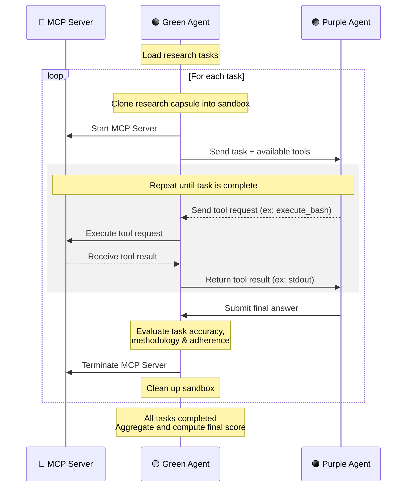

# AgentBeats x CORE-Bench

**Testing AI Agents' Ability to Reproduce Published Scientific Research**

🔬 **[CORE-Bench](https://github.com/siegelz/core-bench)** ("Computational Reproducibility Agent Benchmark") by [Siegel et al.](https://openreview.net/forum?id=BsMMc4MEGS) tests the ability of AI agents to reproduce the results of scientific publications based on code and data provided by their authors. 

We *agentified* CORE-Bench (as implemented in [HAL](https://github.com/princeton-pli/hal-harness)) for the [AgentBeats](https://agentbeats.ai) platform by:
- Adding a "green agent" orchestrator
- Expanding with 27 newer research papers
- Introducing alternative success metric that rewards partial progress toward the goal in lieu of binary pass/fail


## How it works

72 tasks across computer science, social science, and medicine—each testable at three difficulty levels.

| Component           | Role                                                                                          |
| ------------------- | --------------------------------------------------------------------------------------------- |
| 📦 **Code Capsules** | Research tasks containing the original paper's code, data, and dependencies.                  |
| 🟣 **Purple Agent**  | The agent under test. Reasons about tasks and requests actions to reproduce research results. |
| 🟢 **Green Agent**   | Orchestrates the test. Executes Purple's requests and measures reproduction success.          |
| 🔧 **MCP Server**    | Provides the tools Purple uses: file operations, code execution, and more.                    |

### Difficulty Levels
| Difficulty | Agent Has Access To                                               | Agent Must...                             |
| ---------- | ----------------------------------------------------------------- | ----------------------------------------- |
| **Easy**   | Codebase with pre-computed results, run instructions, and scripts | Read and extract answers from results     |
| **Medium** | Codebase with run instructions and scripts                        | Follow instructions to regenerate results |
| **Hard**   | Source code only                                                  | Figure out how to run from scratch        |

We focus on **Hard**, the most realistic and challenging level, where agents face exactly what a researcher faces when trying to reproduce a paper.

---

## Quickstart

1. Clone the repo
```bash
git clone git@github.com:ab-shetty/agentbeats-corebench.git
cd agentbeats-corebench
```
2. Install all dependencies
```bash
uv sync
```
3. Set environment variables: `NEBIUS_API_KEY` & `OPENAI_API_KEY`
```bash
cp sample.env .env
```
4. Run the Benchmark:
```bash
uv run agentbeats-run scenarios/corebench/scenario.toml --show-logs
```

## Custom Configuration

### LLM Models

Configure models in `.env` using the format `provider/model-name`. litellm automatically reads the right API key based on the provider prefix. For example, `gemini/` uses `GOOGLE_API_KEY`.

```bash
COREBENCH_TEXT_MODEL=gemini/gemini-2.0-flash   # Purple agent (default: nebius/openai/gpt-oss-120b)
COREBENCH_JUDGE_MODEL=openai/gpt-5-mini        # LLM-as-judge (default: openai/gpt-5-mini)
GOOGLE_API_KEY=your-api-key
OPENAI_API_KEY=your-openai-key                 # required for vision tool
```

We recommend `gpt-5-mini` for judging. It achieved 56% lower variance than alternatives ([read about our tests here](scenarios/corebench/metrics/internal/LLM_JUDGE_CONSISTENCY.md))

### Benchmark Settings

Configure in `scenario.toml`:
```toml
[config]
domain = "corebench_hard"           # difficulty: _easy, _medium, or _hard
num_tasks = 10                      # tasks to run (max 72)
# task_ids = ["capsule-9670283"]    # run specific tasks
keep_traces = true                  # save execution traces
use_cache = true                    # cache capsules locally
```

---

## Evaluation Metrics

The original CORE-Bench only measured binary pass/fail based on answer accuracy. We add **methodology** and **task adherence** metrics that provide insight into actual progress—how far did the agent get?—and guidance on where it can improve. These metrics have also exposed shortcuts: we found cases where agents retrieved the right answer without genuine reproduction, such as extracting figure labels directly from code.

The evaluator computes three complementary metrics:

**Accuracy** (Deterministic)
- Percentage of correct answers, as in the original CORE-Bench
- Numeric answers use 95% prediction intervals to handle ML stochasticity

**Methodology** (Deterministic, 0-1)
- Evaluates good-practice reproduction methods: Did the agent read the README and script files? Did it execute the expected scripts?
- Points awarded based on how many of these "steps" the agent took

**Task Adherence** (LLM-as-Judge, 0-1)
- Passes tool calls, results, task README, and questions to an LLM judge
- Scores the agent on:
  - *Process quality*: Did it execute the correct scripts and extract results?
  - *Problem solving*: How well did it handle errors?
  - *Discovery*: How efficiently did it find information?
  - *Technical ability*: Command correctness, avoiding redundant operations
- *Gold Standard for hard mode: Understand the codebase → Execute the code → Debug errors if needed → Extract results*

**Interpreting results:**
- High accuracy + low methodology → agent likely took shortcuts
- Low accuracy + high methodology → correct process but environment/dependency issues
- All metrics aligned → agent succeeded or failed consistently

### 🏆 [Leaderboard](https://agentbeats.dev/ab-shetty/corebench-green)

For the leaderboard, we report the original **tasks passed** accuracy alongside a new **process score**—an aggregate of accuracy, methodology, and task adherence (described above). This metric captures agent capabilities better than pass/fail alone, rewarding partial progress and good process even when final answers are incorrect.

```
process_score = (0.7 × (methodology_score + adherence_score) / 2 + tasks_passed) / total_tasks × 100
```

See our [detailed metrics documentation](scenarios/corebench/metrics/README.md) for scoring weights and [LLM judge consistency tests](scenarios/corebench/metrics/internal/LLM_JUDGE_CONSISTENCY.md).

---

## Results & Logs

After the benchmark completes, you'll see a summary:

```text
================================================================================
🏆 EVALUATION COMPLETE
================================================================================
✅ Success Rate: 7/25 (28.0%)
📊 Mean Accuracy: 32.0%
📋 Mean Task Adherence: 0.53/1.0
🔧 Mean Methodology Score: 0.49/1.0
   - Doc Read Rate: 76.0%
   - Execution Attempt Rate: 56.0%
   - Successful Execution Rate: 12.0%
```

Per-task output shows detailed scoring breakdown:

```text
1️⃣  Computing accuracy...
   ✓ Accuracy: 1/1 (100.0%)

2️⃣  Extracting methodology metrics...
   ✓ Methodology Score: 0.35/1.0
   Score Breakdown:
     Doc Read:        0.15/0.15  (README.md)
     Script Read:     0.20/0.20  (code/step_2_plot_top1_top2.py)
     Script Attempt:  0.00/0.45  (not attempted)
     Run Success:     0.00/0.20  (✗ no successful run)

3️⃣  Computing task adherence (LLM judge)...
   ✓ Adherence Score: 0.67/1.0

💭 Judge Reasoning:
   Core Process (28/50) – Understood the code but did not finish the required script.
   Problem Solving (19/25) – Strong debugging: identified and fixed multiple issues.
   Discovery (12/15) – Quickly located README and relevant files.
   Technical (8/10) – Correct commands, minimal redundancy.
```

Full execution traces are saved to: `logs/traces/corebench_trace_<date>_<run_id>.jsonl`

---


## Repository Overview

```
agentbeats-corebench/
├── scenarios/
│   └── corebench/
│       ├── scenario.toml
│       ├── corebench_agent.py      # Purple agent
│       ├── corebench_evaluator.py  # Green agent
│       ├── mcp_server.py           
│       ├── mdconvert.py            # Markdown conversion
│       ├── planning_prompts.yaml   # ReAct planning prompts (from smolagents MultiStepAgent)
│       ├── core_test.json.gpg      # Encrypted task definitions
│       ├── capsule_extension.json.gpg 
│       ├── metrics/                
│       ├── capsules/               # Cached research capsules
│       └── workspace/              # Purple agent execution sandbox
├── src/agentbeats/
│   ├── run_scenario.py             # CLI entrypoint (agentbeats-run)
│   ├── client.py                   # A2A client
│   ├── green_executor.py           
│   ├── tool_provider.py            # MCP tool integration
│   └── models.py                   
├── logs/traces/
├── sample.env
└── pyproject.toml                  
```

### 🔒 Encrypted Test Set
The task definitions (`core_test.json.gpg` and `capsule_extension.json.gpg`) are GPG-encrypted to prevent ground truth leakage. For local runs, the evaluator will provide decryption instructions if needed.

---

## Architecture Diagram



The purple agent never communicates directly with the MCP server. Green acts as the intermediary, receiving tool requests from Purple via A2A and executing them against the MCP server.

---

## Troubleshooting

| Issue                 | Solution                                                                                       |
| --------------------- | ---------------------------------------------------------------------------------------------- |
| **Command timed out** | Increase `timeout` in `mcp_server.py` and `corebench_agent.py`.                                |
| **Empty answers**     | Check MCP client timeout (600s in `corebench_evaluator.py`). Increase if Docker runs are slow. |
| **0% accuracy**       | Check for scale mismatch (0.96 vs 96.12). Agent may be converting percentages incorrectly.     |

---

(See the [AgentBeats tutorial](https://github.com/RDI-Foundation/agentbeats-tutorial) for an explanation of concepts such as green and purple agents, and technical documentation)
