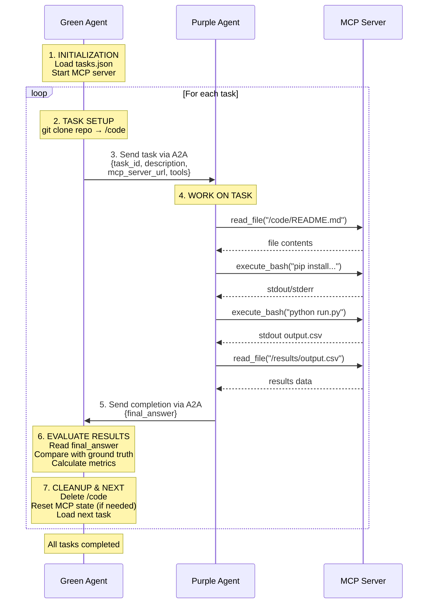

# AgentBeats CoreBench

**Testing AI Agents' Ability to Reproduce Published Scientific Research**

🔬 **[CORE-Bench](https://github.com/siegelz/core-bench)** ("Computational Reproducibility Agent Benchmark") by [Siegel et al.](https://openreview.net/forum?id=BsMMc4MEGS) tests the ability of AI agents to reproduce the results of scientific publications based on code and data provided by their authors. We "agentified" the original benchmark (in its current form as part of [HAL](https://github.com/princeton-pli/hal-harness)) for the [AgentBeats](https://agentbeats.ai) platform (adding a "green agent" orchestrator), expanded the benchmark with newer research papers, and introduced an alternative success metric that rewards partial progress toward the goal in lieu of the original binary pass/fail metric.

## Quickstart
1. Clone the repo
```bash
git clone git@github.com:ab-shetty/agentbeats-corebench.git 
cd agentbeats-corebench
```
2. Install dependencies
```bash
uv sync
```
3. Set environment variables: `NEBIUS_API_KEY` & `OPENAI_API_KEY` in `.env`
```bash
cp sample.env .env
```
4. (Optional) Configure LLM model in `.env` or `scenario.toml` (see LLM Configuration below)
   
5. Run the CoreBench Scenario:
```bash
uv run agentbeats-run scenarios/corebench/scenario.toml --show-logs
```
**Note:** Use `--show-logs` to see agent outputs during the assessment, and `--serve-only` to start agents without running the assessment.

## Custom LLM Configuration

The purple agent uses **Nebius API** `nebius/openai/gpt-oss-120b` & **OpenAI API** `gpt-5-mini` (for vision/judge) **by default**. You can customize the LLM model used by the purple agent on the Nebius API in two ways:

   1. Defining an environment variable in `.env`:
   ```bash
   COREBENCH_TEXT_MODEL=meta-llama/Llama-3.3-70B-Instruct
   ```

   2. Adding a model argument in `scenario.toml`:
   ```toml
   [[participants]]
   cmd = "python scenarios/corebench/corebench_agent.py ... --model meta-llama/Llama-3.3-70B-Instruct"
   ```

*(Run as usual)*

**Custom LLM Configuration Priority:**

Model selection follows this priority (highest to lowest):
1. CLI `--model` in `scenario.toml` - best for testing different models quickly
2. `COREBENCH_TEXT_MODEL` env var - good for persistent defaults
3. Default - `nebius/openai/gpt-oss-120b`

<details>
<summary><strong>Advanced: Self-Hosted vLLM</strong></summary>

For users running their own vLLM server locally:

1. Start your vLLM server
2. Configure `.env`:
   ```bash
   COREBENCH_TEXT_API_BASE=http://127.0.0.1:8000/v1
   COREBENCH_TEXT_MODEL=Qwen/Qwen3-Coder-30B-A3B-Instruct
   COREBENCH_TEXT_API_KEY=dummy
   ```
3. Run as usual:
   ```bash
   uv run agentbeats-run scenarios/corebench/scenario.toml --show-logs
   ```

When `COREBENCH_TEXT_API_BASE` is set, the agent routes requests to your local server instead of Nebius.

</details>

---

## Difficulty Levels

Select the difficulty level by modifying the `domain` field in `scenario.toml`:

```toml
[config]
domain = "corebench_easy"  # Options: "corebench_easy", "corebench_medium", "corebench_hard"
```

| Difficulty | What's Removed                              | Agent Must...                               |
| ---------- | ------------------------------------------- | ------------------------------------------- |
| **Easy**   | Nothing                                     | Execute existing code, extract results      |
| **Medium** | `results/` folder                           | Re-run experiments to regenerate results    |
| **Hard**   | `results/` + `REPRODUCING.md` + run scripts | Figure out how to run the code from scratch |

---

## Leaderboard Panel 

| Task Passed              | Process Score                                           |
| ------------------------ | ------------------------------------------------------- |
| Tasks with 100% Accuracy | Aggregate of Methodololgy, Task Adherence, and Accuracy |


---

## Evaluation Metrics

CoreBench uses three complementary metrics:

| Metric                | Type          | Description                                                                                                                                              |
| --------------------- | ------------- | -------------------------------------------------------------------------------------------------------------------------------------------------------- |
| **Accuracy**          | Deterministic | Measures correctness of final answers. Numeric answers use 95% prediction intervals to handle ML stochasticity. Split into written vs. vision questions. |
| **Methodology Score** | Deterministic | Trace-based evaluation of agent process: Did it read documentation? Execute the right scripts? Recover from errors? Domain-specific scoring weights.     |
| **Task Adherence**    | LLM-as-Judge  | Qualitative assessment (0-1) of how well the agent followed instructions, navigated the codebase, and solved problems efficiently.                       |

### Methodology Scoring by Difficulty

| Component            | Easy | Medium | Hard |
| -------------------- | ---- | ------ | ---- |
| Doc Reading          | 100% | 25%    | 15%  |
| Script Reading       | -    | 15%    | 20%  |
| Execution Coverage   | -    | 35%    | 45%  |
| Successful Execution | -    | 25%    | 20%  |

We've done thourough consistency checks on our LLM-as-a-judge, documented [here](scenarios/corebench/metrics/llm_judge_consistency.md).

---

## Results & Logs

You will see real-time evaluation metrics in your terminal after the benchmark run completes: 

```text
⭐ CoreBench Benchmark Results ⭐
Domain: corebench_hard
Tasks: 1/5 passed (20.0%)

📊 Accuracy Metrics:
  Accuracy: 20.0%
  Written: 0.0%, Vision: 20.0%

🔧 Methodology Metrics (Deterministic):
  Methodology Score: 0.38/1.0
  Doc Read Rate: 80.0%
  Execution Attempt Rate: 40.0%
  Successful Execution Rate: 40.0%
  Error Recovery Rate: 100.0%

📋 Task Adherence (LLM Judge): 0.54/1.0

⚡ Total Time: 264.1s
  Cost Efficiency: $0.017900/task (total: $0.0895)
  Tokens: 475,515 input, 30,284 output

📋 Task Results:
  capsule-9641396: ✅ (acc=100.0%, process=0.35)
  capsule-6003668: ❌ (acc=0.0%, process=0.00)
  capsule-8234136: ❌ (acc=0.0%, process=0.70)
  capsule-9660931: ❌ (acc=0.0%, process=0.70)
  capsule-0625246: ❌ (acc=0.0%, process=0.15)
```
Full execution traces are saved to:
```
logs/traces/corebench_trace_*.jsonl
```

---

## Testing the MCP Server

To test the MCP server functionality using an interactive, web-based MCP inspector:

1. Navigate to `scenarios/corebench` and run:
```bash
uv run mcp dev mcp_server.py
```

2. Click **Connect** > **Tools** > **List Tools** > Select tool to test


3. Alternatively, run the Python test harness (starts MCP server and communicates via JSON-RPC):
```bash
uv run python test_mcp_tools_jsonrpc_full.py
```

## Project Structure

```
agentbeats-corebench/
├── scenarios/
│   └── corebench/
│       ├── scenario.toml          # Scenario config
│       ├── corebench_agent.py     # Purple agent
│       ├── corebench_evaluator.py # Green agent
│       ├── mcp_server.py          # MCP tool server
│       ├── mdconvert.py           # Markdown conversion utilities
│       ├── planning_prompts.yaml  # ReAct planning prompts (from smolagents MultiStepAgent)
│       ├── core_test.json         # Task definitions    
│       ├── metrics/               # Evaluation metrics       
│       ├── capsules/              # Downloaded research capsules
│       ├── workspace/             # Capsule execution sandbox
│       └── shared_logging.py      
├── src/agentbeats/
│   ├── run_scenario.py            # Main CLI entrypoint (agentbeats-run)
│   ├── client.py                  # A2A client implementation
│   ├── green_executor.py          # Green agent execution logic
│   ├── tool_provider.py           # MCP tool integration
│   └── models.py                  # Shared data models
├── logs/
│   └── traces/                    
├── sample.env                     # Template for environment variables
└── pyproject.toml                 # Python dependencies (uv)
```

### Key Components

| Component         | Role                                                                                                                          |
| ----------------- | ----------------------------------------------------------------------------------------------------------------------------- |
| **Purple Agent**  | LLM-powered reasoning agent. Receives tasks, thinks, and emits structured tool intents (JSON). Never executes tools directly. |
| **Green Agent**   | Orchestrator & evaluator. Sends tasks to purple, executes tool calls via MCP, compares results to ground truth.               |
| **MCP Server**    | Provides tools (file read/write, bash execution, etc.) that the green agent invokes on behalf of purple.                      |
| **scenario.toml** | Defines agent endpoints, commands, and config (domain, task count, MCP settings).                                             |

---

## Troubleshooting

| Issue                 | Solution                                                                                               |
| --------------------- | ------------------------------------------------------------------------------------------------------ |
| **Command timed out** | Increase `timeout` in `mcp_server.py` (default 900s/15min). Heavy ML on ARM64 emulation may need more. |
| **Empty answers**     | Check MCP client timeout (600s in `corebench_evaluator.py`). Increase if Docker runs are slow.         |
| **0% accuracy**       | Check for scale mismatch (0.96 vs 96.12). Agent may be converting percentages incorrectly.             |

---

# Architectural Diagram


(See the [AgentBeats tutorial](https://github.com/RDI-Foundation/agentbeats-tutorial) for an explanation of concepts such as green and purple agents, and technical documentation)
